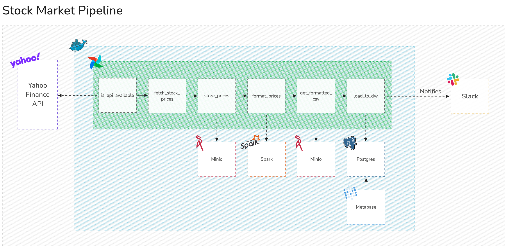

# Introduction

I enrolled in *“Apache Airflow: The Hands-On Guide”*, an A-to-Z course taught by **Marc Lamberti**, **Head of Customer Education at Astronomer**, and I mastered how to programmatically author, schedule, and monitor workflows with Airflow’s TaskFlow API, operators, executors, and integrations.

## Throughout the course, I:
- Learned Airflow fundamentals — how the scheduler, web server, and metadata database interact.
- Built the Forex Data Pipeline, exploring HTTP, Spark, Hadoop, Slack integrations, and more.
- Mastered DAG design: timezones, catchup, unit testing, folder structure, subDAGs, cross-DAG dependencies, and deadlock avoidance.
- Scaled Airflow with Local, Celery, and Kubernetes Executors; specialized workers; handled node failures; and ran a 3-node Rancher cluster locally.
- Templated DAGs, implemented DAG dependencies, and deep-dived into advanced concepts like SubDAGs and deadlocks.
- Deployed an AWS EKS cluster with Rancher for cloud-based KubernetesExecutor runs.
- Monitored Airflow using Elasticsearch and Grafana dashboards.
- Secured my instance with RBAC, authentication, password policies, and data encryption.

By completing hands-on exercises and quizzes at each section, I reinforced best practices and emerged confident in using Airflow in production environments.

## Stock Market Project Overview

**Stock Market Project** is an end-to-end data orchestration project built with Apache Airflow, Docker, Spark, MinIO, PostgreSQL, and Metabase. It ingests stock data from the Yahoo Finance API, processes and stores it, and visualizes key metrics and trends for Apple Inc. via a Metabase dashboard. Upon successful completion, a Slack notification is sent to your team.

## Objectives

* **Build a complete data pipeline** from ingestion through delivery.
* **Implement diverse task types** including sensors, Python operators, Spark jobs, and data loaders.
* **Monitor and manage workflows** using Airflow’s UI with retries and logging.
* **Integrate with external tools** such as MinIO, Spark, Postgres, Metabase, and Slack.

## Pipeline Architecture



## Key Components

### 1. Apache Airflow

* **DAG Definition**: Uses TaskFlow API in `stock_market.py`.
* **Sensor Task**: `is_api_available` checks Yahoo Finance API readiness.
* **Data Fetch**: `get_stock_prices` (via PythonOperator) calls a helper function to retrieve raw JSON.
* **Storage & Processing Tasks**:

  * `store_prices`: saves raw JSON to MinIO.
  * `format_prices`: triggers a Spark job to transform and enrich data.
  * `get_formatted_csv`: retrieves the processed CSV’s filename from MinIO.
  * `load_to_dw`: loads final tables into PostgreSQL.
* **Notification**: Sends a Slack message on pipeline success.

### 2. Yahoo Finance API

* Provides real-time and historical stock data.
* Accessed via an HTTP connection (`stock_api`) configured in Airflow.

### 3. MinIO

* Acts as an S3-compatible object store for raw and processed data.

### 4. Apache Spark

* Processes raw JSON files and outputs cleaned CSVs.

### 5. PostgreSQL (Data Warehouse)

* Stores final analytical tables for historical price data and aggregates.

### 6. Metabase Dashboard

* Connects to PostgreSQL to visualize:

  * **Average Close Price**
  * **Average Volume**
  * **Time-series chart** of Close and Volume for Apple Inc.

### 7. Slack Notifications

* Alerts a designated Slack channel when the pipeline completes successfully.

## Dashboard Insights

The Metabase dashboard provides:

* **Average Close Price** of Apple over the last year
* **Average Volume** traded
* **Time-series visualization** of daily Close and Volume trends

## Getting Started

1. **Clone the repository**
   ```bash
   git clone https://github.com/BrunoChiconato/airflow-project.git
   cd airflow-project
   ```

2. **Configure Airflow Connections**

   * **stock\_api** (HTTP): `https://query1.finance.yahoo.com`
   * **minio\_conn** (S3): endpoint, access key, secret key
   * **postgres\_dw** (Postgres): host, user, password, database
   * **slack\_webhook** (HTTP): Slack incoming webhook URL

3. **Launch the stack**

   ```bash
   docker-compose up -d
   ```

4. **Access the services**

   * Airflow UI: `http://localhost:8080`
   * MinIO Console: `http://localhost:9001`
   * Spark UI: `http://localhost:4040`
   * PostgreSQL (psql): port `5432`
   * Metabase: `http://localhost:3000`

5. **Trigger and Monitor**

   * Unpause the `stock_market` DAG in Airflow and trigger a run.
   * Watch task logs and await the Slack notification for completion.
