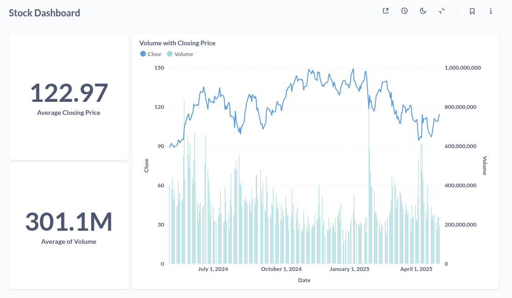

# Introduction

I enrolled in *“Apache Airflow: The Hands-On Guide”*, an A-to-Z course taught by **Marc Lamberti**, **Head of Customer Education at Astronomer**, and I mastered how to programmatically author, schedule, and monitor workflows with Airflow’s TaskFlow API, operators, executors, and integrations.

## Throughout the course, I:
- Learned Airflow fundamentals — how the scheduler, web server, and metadata database interact.
- Built the Forex Data Pipeline, exploring HTTP, Spark, Hadoop, Slack integrations, and more.
- Mastered DAG design: timezones, catchup, unit testing, folder structure, subDAGs, cross-DAG dependencies, and deadlock avoidance.
- Scaled Airflow with Local, Celery, and Kubernetes Executors; specialized workers; handled node failures; and ran a 3-node Rancher cluster locally.
- Templated DAGs, implemented DAG dependencies, and deep-dived into advanced concepts like SubDAGs and deadlocks.
- Deployed an AWS EKS cluster with Rancher for cloud-based KubernetesExecutor runs.
- Monitored Airflow using Elasticsearch and Grafana dashboards.
- Secured my instance with RBAC, authentication, password policies, and data encryption.

By completing hands-on exercises and quizzes at each section, I reinforced best practices and emerged confident in using Airflow in production environments.

## Stock Market Project Overview

**Stock Market Project** is an end-to-end data orchestration project built with Apache Airflow, Docker, Spark, MinIO, PostgreSQL, and Metabase. It ingests stock data from the Yahoo Finance API, processes and stores it, and visualizes key metrics and trends for NVIDIA via a Metabase dashboard. Upon successful completion, a Slack notification is sent to your team.

## Objectives

* **Build a complete data pipeline** from ingestion through delivery.
* **Implement diverse task types** including sensors, Python operators, Spark jobs, and data loaders.
* **Monitor and manage workflows** using Airflow’s UI with retries and logging.
* **Integrate with external tools** such as MinIO, Spark, Postgres, Metabase, and Slack.

## Pipeline Architecture


## Key Components

### 1. Apache Airflow

* **DAG Definition**: Uses TaskFlow API in `stock_market.py`.
* **Sensor Task**: `is_api_available` checks Yahoo Finance API readiness.
* **Data Fetch**: `get_stock_prices` (via PythonOperator) calls a helper function to retrieve raw JSON.
* **Storage & Processing Tasks**:

  * `store_prices`: saves raw JSON to MinIO.
  * `format_prices`: triggers a Spark job to transform and enrich data.
  * `get_formatted_csv`: retrieves the processed CSV’s filename from MinIO.
  * `load_to_dw`: loads final tables into PostgreSQL.
* **Notification**: Sends a Slack message on pipeline success.

### 2. Yahoo Finance API

* Provides real-time and historical stock data.
* Accessed via an HTTP connection (`stock_api`) configured in Airflow.

### 3. MinIO

* Acts as an S3-compatible object store for raw and processed data.

### 4. Apache Spark

* Processes raw JSON files and outputs cleaned CSVs.

### 5. PostgreSQL (Data Warehouse)

* Stores final analytical tables for historical price data and aggregates.

### 6. Metabase Dashboard

* Connects to PostgreSQL to visualize:

  * **Average Close Price**
  * **Average Volume**
  * **Time-series chart** of Close and Volume for NVIDIA.

### 7. Slack Notifications

* Alerts a designated Slack channel when the pipeline completes successfully.

## Dashboard Insights

The Metabase dashboard provides:

* **Average Close Price** of NVIDIA over the last year
* **Average Volume** traded
* **Time-series visualization** of daily Close and Volume trends



## Getting Started

### Prerequisites

* **Astro CLI** installed.
  See [Astro’s official docs](https://www.astronomer.io/docs/astro/cli/install-cli)
* **Docker** installed and running
* **System requirements**

  * ≥ 8 GB RAM allocated to Docker (Spark jobs require substantial memory)
  * Sufficient disk space for Docker images
* **Platform**: The provided `docker-compose.yml` is configured for Linux hosts.

### Setup & Run

1. **Clone the repository**
   ```bash
   git clone https://github.com/BrunoChiconato/airflow-project.git
   cd airflow-project
   ```

2. **Ensure Astro is stopped**

   ```bash
   astro dev stop
   ```

3. **Build Docker images**

   ```bash
   # Spark master
   cd spark/master
   docker build -t airflow/spark-master .

   # Spark worker
   cd ../worker
   docker build -t airflow/spark-worker .

   # Stock-transform app
   cd ../notebooks/stock_transform
   docker build -t airflow/stock-app .
   ```

4. **Return to project root**

   ```bash
   cd ../../../
   ```

5. **Start your environment**

   ```bash
   astro dev start
   ```

6. **Verify in Airflow UI**

   * Open: [http://localhost:8080](http://localhost:8080)
   * Log in with:

     * **Username:** `admin`
     * **Password:** `admin`

7. **Configure Airflow Connections**

   Navigate to **Admin > Connections**. Click the **"+"** icon to add the following connections:

   #### `stock_api`

   * **Connection ID:** `stock_api`
   * **Connection Type:** `HTTP`
   * **Host:** `https://query1.finance.yahoo.com`
   * **Extra:**

   ```json
   {
      "endpoint": "/v8/finance/chart/",
      "headers": {
         "Content-Type": "application/json",
         "User-Agent": "Mozilla/5.0",
         "Accept": "application/json"
      }
   }
   ```

   #### `minio`

   * **Connection ID:** `minio`
   * **Connection Type:** `Amazon Web Services`
   * **AWS Access Key ID:** `minio`
   * **Extra:**

   ```json
   {
      "endpoint_url": "http://minio:9000"
   }
   ```

   #### `postgres`

   * **Connection ID:** `postgres`
   * **Connection Type:** `Postgres`
   * **Host:** `postgres`
   * **Login:** `postgres`
   * **Port:** `5432`

   #### `slack`

   * **Connection ID:** `slack`
   * **Connection Type:** `Slack API`
   * **Slack API Token:** *You must create and provide a valid token*

8. **Trigger and Monitor**

   * Unpause the `stock_market` DAG in Airflow and trigger a run.
   * Watch task logs and await the Slack notification for completion.

0. **Metabase Dashboard**

   Since the Docker persistent data was not committed, the example dashboard will not be available by default. If you wish to create your own dashboard, follow the steps below:

   1. Open your browser and go to [http://localhost:3000/](http://localhost:3000/).

   2. Complete the initial setup steps in Metabase with any values **except** during the **"Add your data"** step. At that point, choose **PostgreSQL** and enter the following database connection details:

      * **Display name**: e.g., `DW`
      * **Host**: `postgres`
      * **Port**: `5432`
      * **Username**: `postgres`
      * **Password**: `postgres`
      * **Schemas**: Select **All**

   3. Click **"Connect database"**. The connection must be successful before continuing to the Metabase interface.

   4. After the connection is established, you will be directed to the Metabase dashboard panel. From here, you can explore your data and build custom dashboards using your own metrics and visualizations.

### Troubleshooting

* Make sure no other services are listening on the ports defined in `docker-compose.yml` (e.g., 8080, 5432, 9000).
* If you run into memory issues, increase Docker’s RAM allocation to ≥ 8 GB.
* On non-Linux hosts, adjustments to volume mounts or networking settings may be required.